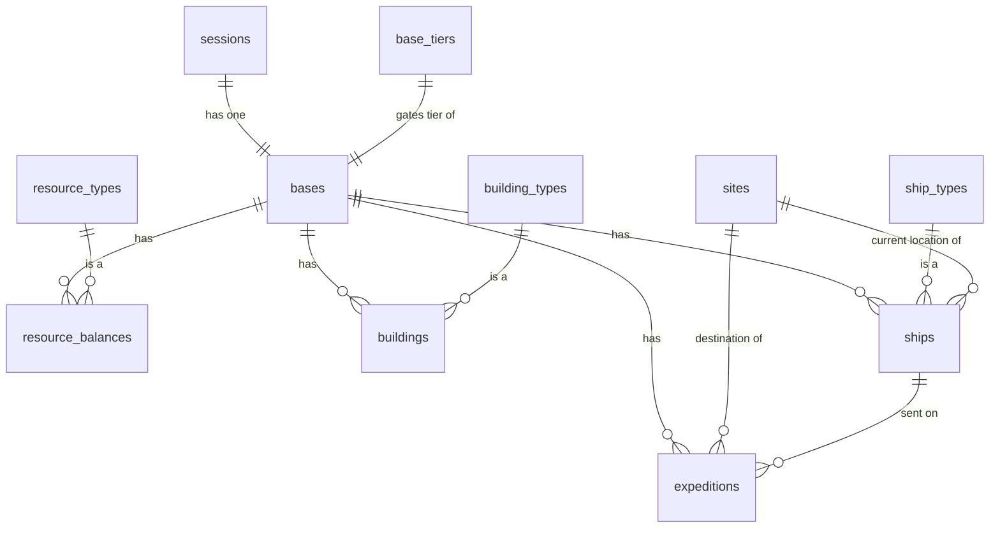

# Database schema

Source of truth is [`init.sql`](init.sql) (structure) and [`seed.sql`](seed.sql)
(catalog data) — this file explains what's in them and why. One player =
one session = one base for this scope: there's no multi-base or
multiplayer support.

Tables split into two groups:

- **Catalog tables** — static game-balance data (`resource_types`,
  `building_types`, `ship_types`, `sites`, `base_tiers`). Seeded once by
  `seed.sql` and re-synced by re-running it (it uses `ON CONFLICT DO
  UPDATE`, not `DO NOTHING` — a balance tweak takes effect on the next
  `make seed-prod`/`make local-migrate` without needing a fresh database).
- **State tables** — everything that changes as a game is played
  (`sessions`, `bases`, `resource_balances`, `buildings`, `ships`,
  `expeditions`). Empty until players actually create sessions.

## Entity relationships

## State tables

### `sessions`

One row per game. `session_token` (not `id`) is what the frontend stores
in `localStorage` and sends on every request — it's what makes "close the
tab, reopen it, same game" work. `last_seen_at` is bumped on every
authenticated request.

| Column | Type | Notes |
|---|---|---|
| `id` | uuid PK | |
| `session_token` | uuid, unique | The bearer credential the frontend holds |
| `display_name` | text | Defaults to "Commander"; not currently editable |
| `created_at` / `last_seen_at` | timestamptz | |

### `bases`

The player's single home base. `tier` and `build_slots` only ever change
via the base-upgrade endpoint (`POST /base/upgrade`), which looks up the
next row in `base_tiers` and applies its `build_slots`.

| Column | Type | Notes |
|---|---|---|
| `id` | uuid PK | |
| `session_id` | uuid → `sessions.id`, `ON DELETE CASCADE` | |
| `name` | text | Defaults to "Home Base" |
| `tier` | int | Starts at 1; gates `building_types.min_base_tier` / `ship_types.min_base_tier` |
| `build_slots` | int | Max concurrent buildings; starts at 4 (matches the 4 tier-1 building types) |

### `resource_balances`

Per-base inventory, one row per resource type. Passive production is
**not** ticked by a scheduler — it's computed lazily on read (`GET
/state`, `POST /collect`) as `elapsed_time × sum(active buildings' rates)`
since `last_collected_at`, which is then reset to now.

| Column | Type | Notes |
|---|---|---|
| `base_id` | uuid → `bases.id`, `ON DELETE CASCADE` | part of PK |
| `resource_code` | text → `resource_types.code` | part of PK |
| `amount` | numeric, `>= 0` | |
| `last_collected_at` | timestamptz | anchor for the lazy production calc |

### `buildings`

A constructed instance of a `building_types` row. A base can only have
one building per `building_code` at a time (enforced in application code,
not a DB constraint) — building further copies of the same type isn't
supported; you upgrade its `level` instead (capped at `building_types.max_level`).

| Column | Type | Notes |
|---|---|---|
| `id` | uuid PK | |
| `base_id` | uuid → `bases.id`, `ON DELETE CASCADE` | |
| `building_code` | text → `building_types.code` | |
| `level` | int | 1..`building_types.max_level` |
| `status` | text | `constructing` \| `active` (currently everything resolves to `active` immediately — `constructing` exists for a future build-time delay) |
| `created_at` | timestamptz | |

### `ships`

A constructed instance of a `ship_types` row. `current_site_id` /
`departed_at` / `eta_at` are only set while `status = 'en_route'`; the
frontend interpolates the ship's visual position between them client-side
rather than polling for smooth movement.

| Column | Type | Notes |
|---|---|---|
| `id` | uuid PK | |
| `base_id` | uuid → `bases.id`, `ON DELETE CASCADE` | |
| `ship_code` | text → `ship_types.code` | |
| `name` | text, nullable | Not currently settable by players |
| `status` | text | `idle` \| `en_route` \| `returning` \| `lost` (`returning`/`lost` aren't emitted by any code path yet — reserved for a future recall feature) |
| `current_site_id` | uuid → `sites.id`, nullable | |
| `departed_at` / `eta_at` | timestamptz, nullable | |
| `created_at` | timestamptz | |

### `expeditions`

One row per ship dispatch, created when a ship departs and filled in when
it resolves. Resolution happens lazily too: any `GET /state` call resolves
every expedition whose ship's `eta_at` has passed, in addition to the
explicit `POST /expeditions/:id/resolve` endpoint — so the game never
feels stuck waiting on a manual step.

| Column | Type | Notes |
|---|---|---|
| `id` | uuid PK | |
| `base_id` | uuid → `bases.id`, `ON DELETE CASCADE` | |
| `ship_id` | uuid → `ships.id` | |
| `site_id` | uuid → `sites.id` | |
| `departed_at` | timestamptz | |
| `resolved_at` | timestamptz, nullable | NULL until resolved |
| `outcome` | text, nullable | `success` \| `partial` \| `failed`, rolled against `sites.risk_pct` |
| `resources_gained` | jsonb, nullable | `{resource_code: amount}`, rolled from `sites.yield_table` |
| `log_message` | text, nullable | Human-readable line shown in the mission log |

Indexes: `idx_expeditions_base (base_id, departed_at DESC)`,
`idx_ships_base (base_id)`, `idx_buildings_base (base_id)` — all support
the "list everything for this base" queries `GET /state` does on every call.

## Catalog tables

### `base_tiers`

The entire progression tree lives in three places: this table, and the
`min_base_tier` column on `building_types`/`ship_types` below. There is no
separate tech-tree table — deliberately, to keep this small.

| Column | Type | Notes |
|---|---|---|
| `tier` | int PK | |
| `build_slots` | int | What `bases.build_slots` becomes at this tier |
| `upgrade_cost` | jsonb, nullable | `{resource_code: amount}` to reach this tier from the previous one. `NULL` for tier 1 (the starting tier — nothing to buy) |

Seed data: tier 1 (4 slots, free/starting), tier 2 (6 slots, costs 5
`unlock_tokens`).

### `resource_types`

| Column | Type | Notes |
|---|---|---|
| `code` | text PK | `metal`, `ice`, `energy`, `rare_isotopes`, `unlock_tokens` |
| `display_name` | text | |
| `is_currency` | boolean | Only `unlock_tokens` — spent on base upgrades, not produced by buildings, only earned from expeditions |

### `building_types`

| Column | Type | Notes |
|---|---|---|
| `code` | text PK | `solar_array`, `mining_rig`, `ice_extractor`, `shipyard`, `sensor_array`, `refinery` |
| `display_name` | text | |
| `max_level` | int | |
| `min_base_tier` | int | `sensor_array`/`refinery` require tier 2; the rest are tier 1 |
| `base_cost` | jsonb | `{resource_code: amount}` to build at level 1 |
| `cost_growth_factor` | numeric | Cost to reach level *N* = `base_cost × cost_growth_factor^(N-1)` |
| `production` | jsonb, nullable | `{"resource": code, "rate_per_hour": number}`, or `NULL` for buildings with no passive output (`shipyard`, `sensor_array`) |
| `unlocks_building_code` | text → `building_types.code`, nullable | Descriptive only right now — `sensor_array` points at `refinery`, but nothing in the backend actually enforces "build the unlocker first"; `min_base_tier` is what's actually checked |

The `rate_per_hour` numbers are tuned for a live demo (visible movement on
an 8-second poll), not a realistic idle-game economy — treat the "per
hour" label as fictional.

### `ship_types`

| Column | Type | Notes |
|---|---|---|
| `code` | text PK | `scout`, `freighter`, `heavy_cruiser` |
| `display_name` | text | |
| `min_base_tier` | int | `heavy_cruiser` requires tier 2 |
| `base_cost` | jsonb | `{resource_code: amount}` |
| `cargo_capacity` | int | Not currently used by any game logic (no cargo limits enforced yet) |
| `speed_factor` | numeric | Effective travel time = `sites.travel_time_minutes / speed_factor` — higher is faster |

### `sites`

The fixed, never-changing set of explorable locations. No per-session
discovery state — every site is visible and dispatchable from the start;
`difficulty` is what gates how risky/rewarding it is, not whether it's
known.

| Column | Type | Notes |
|---|---|---|
| `id` | uuid PK | |
| `code` | text, unique | Stable slug independent of the uuid |
| `display_name` | text | |
| `kind` | text | `asteroid` \| `planet` \| `derelict` — also drives which 3D model the frontend builds |
| `difficulty` | int | 1-4 in the seed data; scales the visual size and (loosely) the risk/reward |
| `risk_pct` | numeric | Chance of a `failed` (empty-handed) outcome on resolution |
| `travel_time_minutes` | int | Base travel time before a ship's `speed_factor` is applied |
| `yield_table` | jsonb | `{resource_code: [min, max]}` — resolution rolls a random amount per resource in range (halved on a `partial` outcome, which triggers on a second, narrower risk band past `risk_pct`) |
| `position` | jsonb | `{x, y, z}` fixed 3D coordinates (scaled by `0.4` in the frontend) for where the site renders relative to the home base |

## JSON column shapes, summarized

| Shape | Used by | Example |
|---|---|---|
| Cost / gain map | `base_tiers.upgrade_cost`, `building_types.base_cost`, `ship_types.base_cost`, `expeditions.resources_gained` | `{"metal": 40, "energy": 10}` |
| Production rate | `building_types.production` | `{"resource": "energy", "rate_per_hour": 900}` |
| Yield range table | `sites.yield_table` | `{"metal": [20, 40], "ice": [5, 15]}` |
| 3D position | `sites.position` | `{"x": 12, "y": 0, "z": 4}` |

## Applying this schema

`make local-migrate` (local Postgres) or `make seed-prod PGHOST=... ...`
(a real Aiven service) both run `init.sql` then `seed.sql` — see the
[root README](../README.md#deploying-to-aiven) for the full deploy
sequence. Both files are safe to re-run against a database that already
has them applied.
